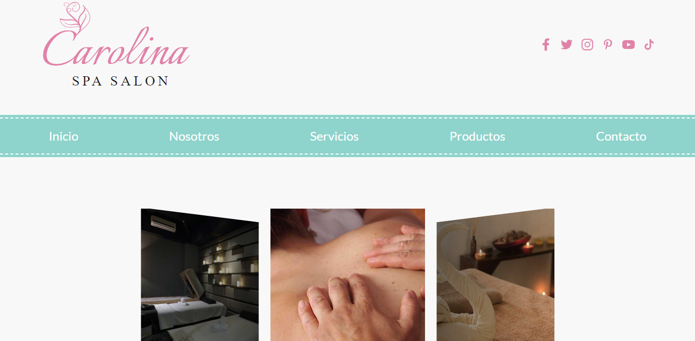
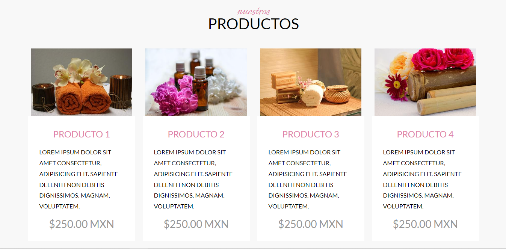

# Carolina Spa - The best rejuvenating and relaxing experience

### Details:

- Built using:
  - HTML, CSS, JavaScript
  - SASS (SCSS)
  - PostCSS (Autoprefixer & CSSNano)
  - Gulp.js
  - Swiper.js
- Best practices
- Responsive Web Design
- BEM methodology
- Supports avif and webp images
- CSS minified and mapped (sourcemaps)

[Link to carolina spa website](https://carolina-spa-experience.netlify.app/)

### Previews:

