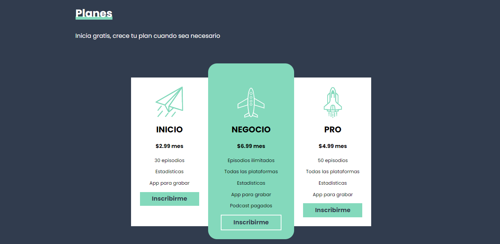

# Podcast FM - A platform to publish your podcast

### Details:

- Built using:
  - HTML, CSS, JavaScript
  - SASS (SCSS)
  - PostCSS (Autoprefixer & CSSNano)
  - Gulp.js
- Best practices
- Responsive Web Design
- BEM methodology
- Image format compatibility detector for browsers
- Supports avif and webp images
- CSS minified and mapped (sourcemaps)
- It's just a static site, no db

[Link to podcast fm website](https://podcast-fm-project.netlify.app/)

### Previews:

